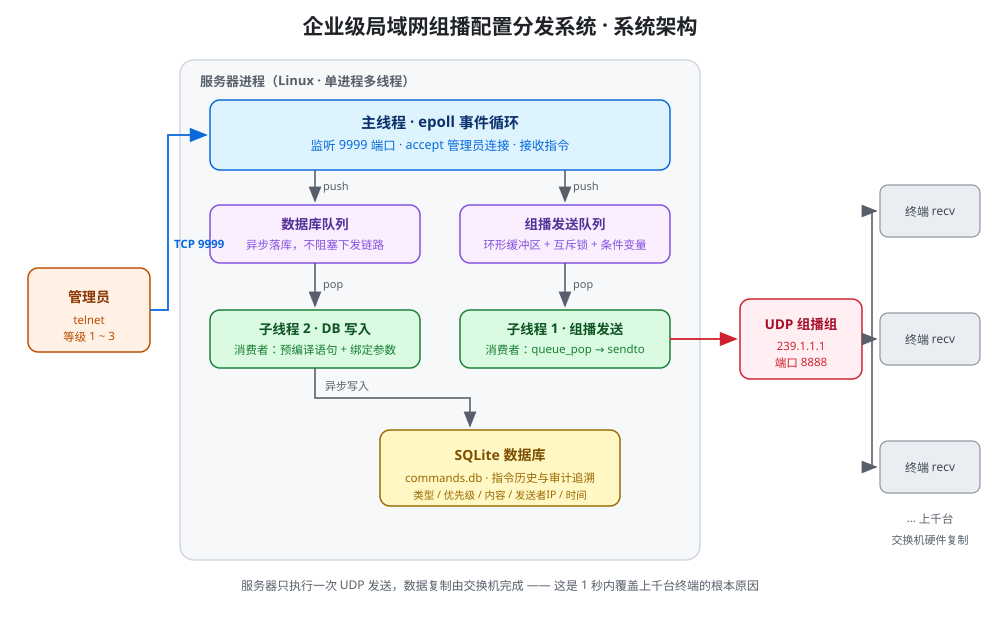
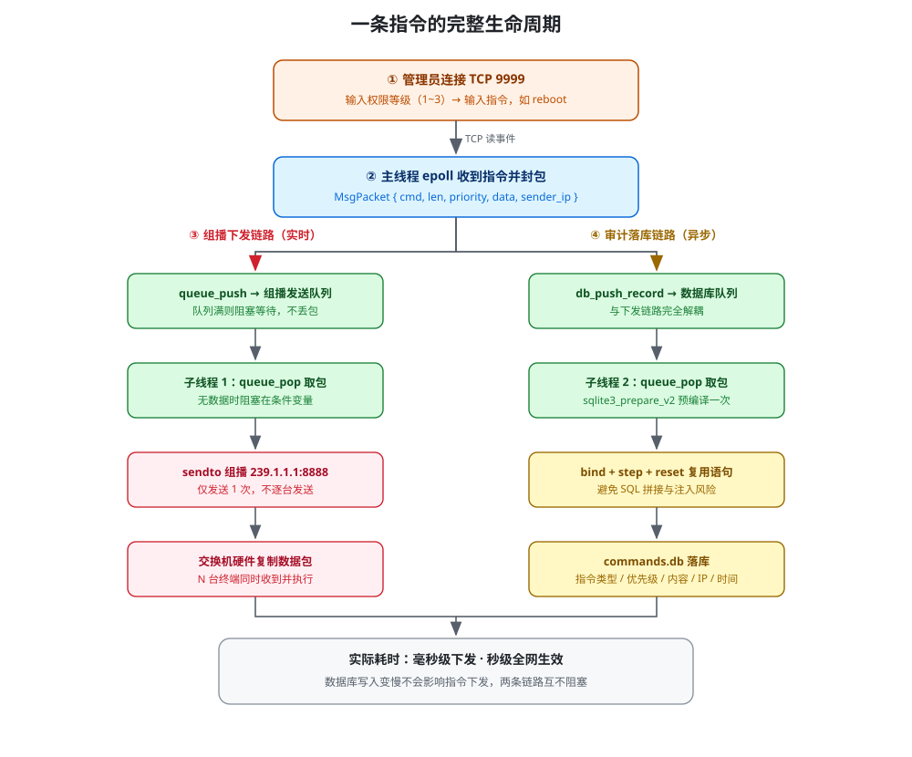
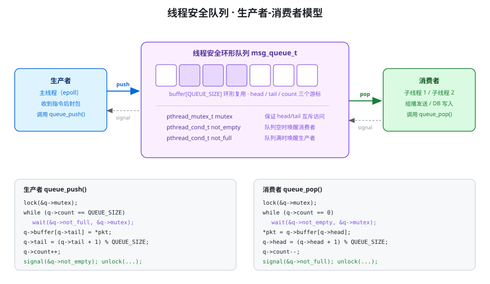

# 企业级局域网组播配置分发系统

> 基于 UDP 组播 + epoll 的「一对多」配置下发系统：管理员通过 TCP 下发一条指令，服务器只发送一次，全网终端同时收到并自动执行，全过程异步落库可审计。


---

## 一、项目背景

在银行柜台、工厂产线终端、CDN 节点、数字标牌这类场景里，运维经常需要**同时**向几百上千台设备下发同一条配置指令（重启、更新、调整日志级别）。

传统做法的瓶颈：

| 方案 | 问题 |
| --- | --- |
| TCP 单播逐台下发 | 服务器要维护 N 条连接、发送 N 次，连接数和 CPU 随终端数线性增长 |
| 人工通知（群聊/电话） | 依赖人执行，会漏看、会延迟，且无法审计「谁在什么时间下了什么指令」 |
| 公网 SaaS / 企业微信 API | 按调用次数收费，且把内网设备暴露到公网，攻击面大 |

本系统的思路是：**服务器只「喊一嗓子」（一次 UDP 组播发送），由交换机硬件负责把数据包复制给所有终端**。服务器压力与终端数量解耦，1 秒内可覆盖上千台设备，且完全运行在内网。

---

## 二、核心功能

1. **管理员 TCP 接入与权限分级**
   管理员 `telnet` 连接服务器 `9999` 端口，先输入权限等级（1~3），等级即指令优先级，随包下发；高优先级指令终端会立即执行。
2. **UDP 组播一次下发**
   服务器把指令打包成自定义二进制协议 `MsgPacket`，向组播组 `239.1.1.1:8888` 发送**一次**，所有加入该组的终端同时收到。
3. **指令历史异步落库**
   每条指令的类型、优先级、内容、发送者 IP、发送时间写入 SQLite，全程异步，不阻塞指令下发主链路。

---

## 三、系统架构



### 一条指令的完整生命周期



### 线程模型

| 线程 | 职责 | 关键实现 |
| --- | --- | --- |
| 主线程 | epoll 监听 listenfd 与所有管理员连接，接收指令 | `epoll_create` / `epoll_ctl` / `epoll_wait` |
| 组播发送线程 | 从队列取包，`sendto` 到组播地址 | 消费者，`pthread_cond_wait` 等待非空 |
| DB 写入线程 | 从 DB 队列取包，写入 SQLite | 预编译语句 + 绑定参数，避免 SQL 拼接 |

线程之间**不共享业务数据**，只通过两个线程安全队列传递 `MsgPacket`，形成两组经典的生产者-消费者模型。

### 生产者-消费者队列



---

## 四、自定义协议

跨设备传输统一使用定长二进制结构体，避免文本协议解析开销与粘包歧义：

```c
typedef struct {
    int  cmd;            // 指令类型：CMD_REBOOT / CMD_UPDATE / CMD_SHUTDOWN / CMD_HEARTBEAT
    int  len;            // 数据长度
    int  priority;       // 优先级 1-3（1 最低，3 最高）
    char data[256];      // 指令内容
    char sender_ip[16];  // 发送者 IP（审计用）
} MsgPacket;
```

| 参数 | 值 |
| --- | --- |
| 组播地址 | `239.1.1.1` |
| 组播端口 | `8888` |
| TCP 管理端口 | `9999` |
| 传输方式 | UDP 组播（下发） + TCP（管理通道） |

---

## 五、快速开始

### 环境依赖

```bash
# Ubuntu / Debian
sudo apt-get install build-essential libsqlite3-dev
```

### 编译

```bash
make          # 生成 server 和 recv
make clean    # 清理
```

### 运行演示

**1）启动若干终端（建议开 2~3 个终端窗口，模拟多台设备）**

```bash
./recv
# 已加入组播组 239.1.1.1:8888
```

**2）启动服务器**

```bash
./server
# [DB] 数据库线程启动
# [TCP管理] 端口 9999，等待管理员连接...
# [服务器] 启动成功
```

**3）管理员下发指令**

```bash
telnet 127.0.0.1 9999
# Please enter your level (1-3): 3
# Level 3 confirmed. Send commands.
reboot
```

此时所有运行 `./recv` 的终端**同时**打印：

```
[终端] 收到指令 [优先级 3]: reboot
   -> 高优先级指令，立即执行！
```

服务器端打印：

```
[管理员指令] reboot (等级 3, IP 127.0.0.1)
[组播发送] 指令: reboot (优先级 3)
```

**4）审计查询**

```bash
sqlite3 commands.db "SELECT * FROM t_commands;"
```

---

## 六、目录结构

```
.
├── Makefile                  # 一键编译
├── include/
│   ├── protocol.h            # 组播地址/端口、指令类型、MsgPacket 定义
│   ├── queue.h               # 线程安全队列接口
│   └── db.h                  # 数据库异步写入接口
├── src/
│   ├── main.c                # 服务器主程序：epoll 事件循环 + 线程创建
│   ├── queue.c               # 环形队列 + 互斥锁 + 条件变量（生产者-消费者）
│   ├── db.c                  # SQLite 异步写入线程
│   └── tcp_server.c          # TCP 服务端原型（早期版本，保留演进记录）
├── client/
│   └── multicast_recv.c      # 终端接收程序：加组 + 收包解析
├── docs/                     # 架构图与流程图（SVG 源文件）
└── commands.db               # 运行后生成（已 gitignore）
```

---

## 七、技术要点

- **为什么用组播而不是广播**：广播（`255.255.255.255`）会打扰网段内所有主机且通常被路由器隔离；组播只有加入组的成员才会收，可跨网段且不打扰无关设备。
- **为什么用 epoll 而不是 select/poll**：`select` 有 `FD_SETSIZE`（1024）上限且每次调用要重复拷贝 fd 集合、O(n) 轮询；`epoll` 使用内核红黑树 + 就绪队列，事件复杂度 O(1)，适合管理大量管理员长连接。
- **双队列解耦**：组播下发与数据库写入分成两个队列、两个消费者线程。数据库是慢 I/O，即便 SQLite 瞬时抖动，也不会拖慢指令下发主链路。
- **生产者-消费者实现**：固定大小环形缓冲区 + `pthread_mutex_t` 保证互斥，`not_empty` / `not_full` 两个条件变量实现阻塞等待，避免忙轮询空转 CPU。
- **SQLite 预编译语句**：`sqlite3_prepare_v2` 只编译一次，循环内 `bind` + `step` + `reset`，既提升性能又天然避免 SQL 注入。
- **安全性**：系统完全运行在内网，不向公网暴露端口；相比把设备管控放到公网 SaaS，攻击面显著更小。

---

## 八、后续演进（Roadmap）

- [ ] 指令类型解析：当前服务端统一置为 `CMD_REBOOT`，后续按指令内容映射到 `CMD_UPDATE` / `CMD_SHUTDOWN` 等类型
- [ ] 终端心跳上报（`CMD_HEARTBEAT`）与在线终端状态表，实现「下发 + 确认」闭环
- [ ] 组播可靠性增强：UDP 无重传，可补充序列号 + 丢包重传或应用层 ACK
- [ ] 管理员鉴权从「等级自报」升级为账号密码 / Token 认证
- [ ] 下位机延伸：用 STM32 + FreeRTOS 实现真实设备端，形成端到端闭环

---

## 九、License

MIT License
